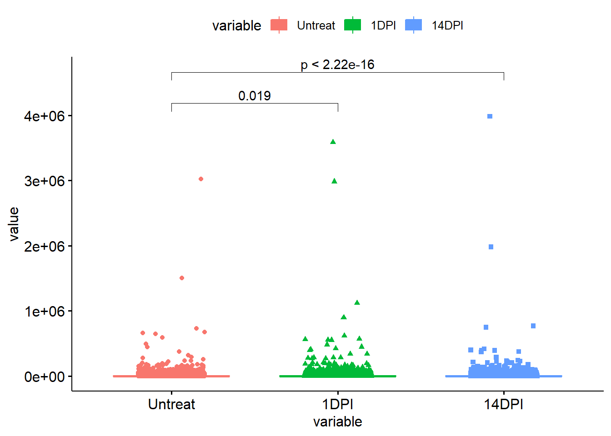
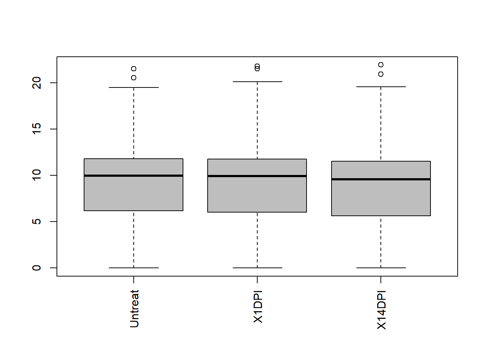
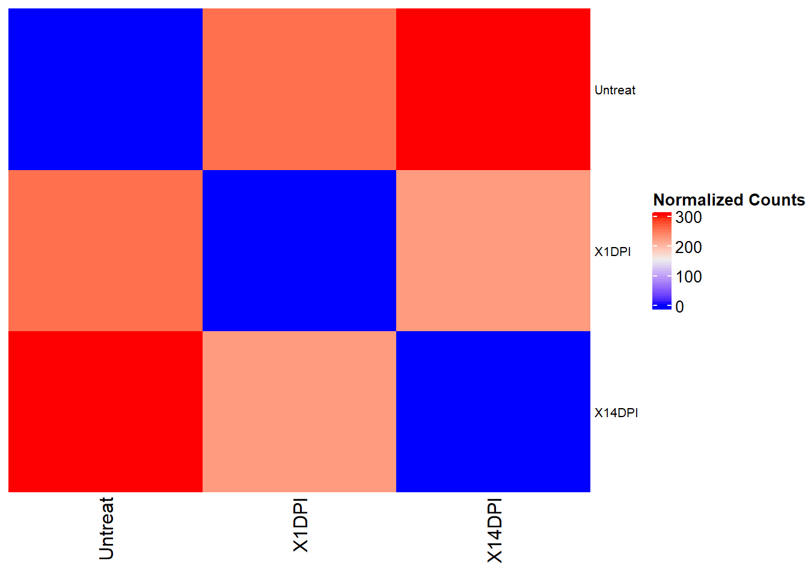
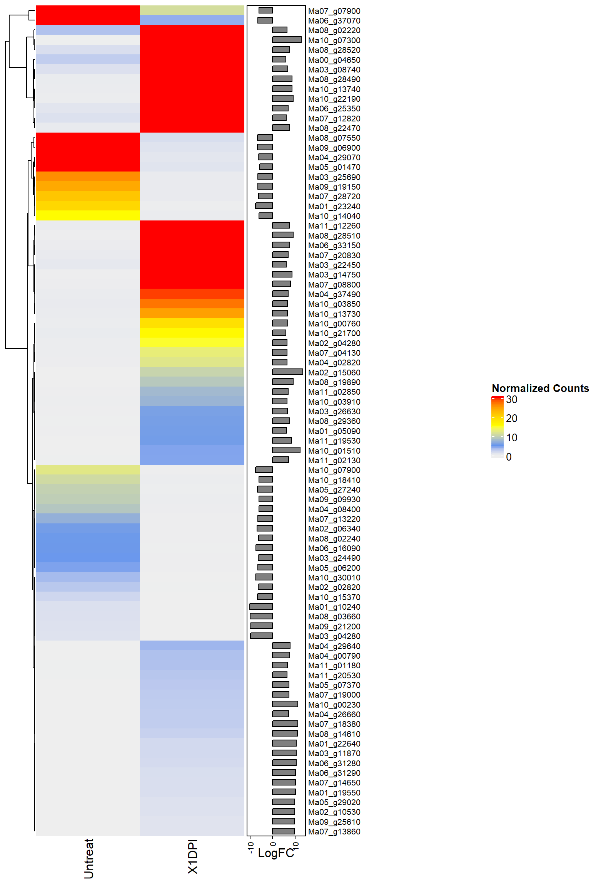
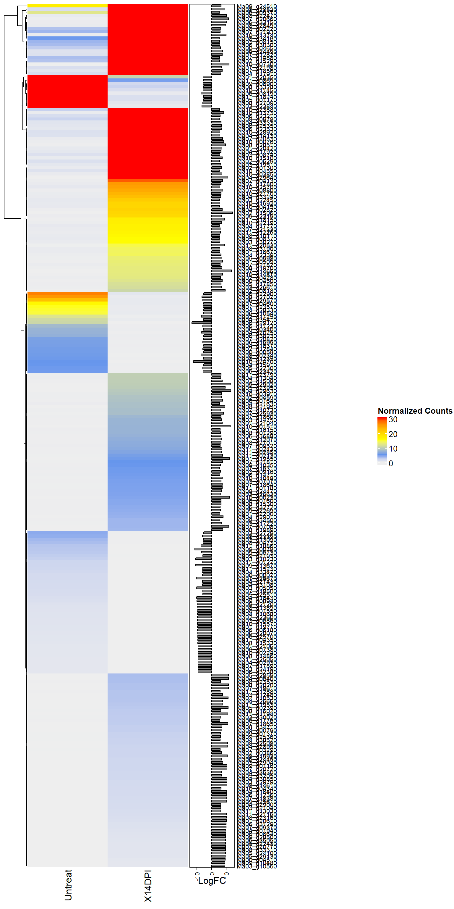
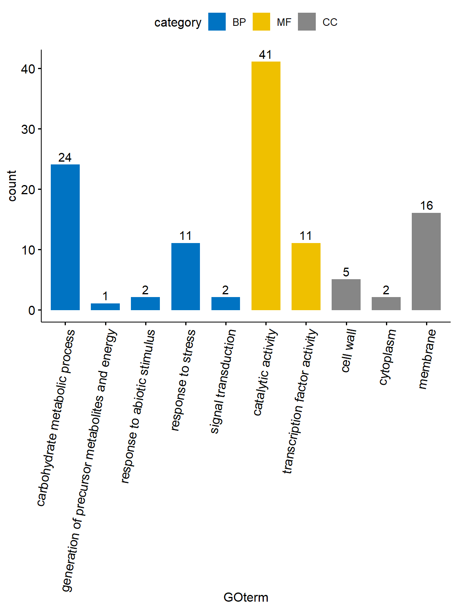

## Background


```
## Number of genes:35276 ...
```

## Methods

* Map transcriptome reads to all 35276 genes using Bowtie2
* Counting the number of reads mapped using Bedtools (Raw counts)
* Raw counts are counts per million (CPM) normalised using `edgeR` package using non-replicate dispersion method (`estimateGLMCommonDisp`)
* Identify differentially expressed (based on pvalue < 0.05) WRKY genes between `Untreatvs1DPI`,`Untreatvs14DPI` comparisons. 
* Heatmaps were generated using `ComplexHeatmap` with log2 fold changes as row-wise bar plots. 


## Coverage of Fusarium treated musa root transcriptomes 




## Log Normalization of data using edgeR


```
##             Untreat X1DPI X14DPI
## Ma00_g00010    6129  4382   3014
## Ma00_g00020    2784  4196   1953
## Ma00_g00030    1206  1666   3109
## Ma00_g00040     695   849    688
## Ma00_g00050    4267  5358   3883
## Ma00_g00060     128   292    285
```

```
##         condition
## Untreat   Untreat
## X1DPI        1DPI
## X14DPI      14DPI
```

```
## An object of class "DGEList"
## $counts
##             Untreat X1DPI X14DPI
## Ma00_g00010    6129  4382   3014
## Ma00_g00020    2784  4196   1953
## Ma00_g00030    1206  1666   3109
## Ma00_g00040     695   849    688
## Ma00_g00050    4267  5358   3883
## 35167 more rows ...
## 
## $samples
##           group  lib.size norm.factors
## Untreat Untreat 136216068            1
## X1DPI      1DPI 133035523            1
## X14DPI    14DPI 117512930            1
```

```
##               Untreat     X1DPI    X14DPI
## Ma00_g00010 12.581671 12.097703 11.557942
## Ma00_g00020 11.443462 12.035143 10.932215
## Ma00_g00030 10.237210 10.703038 11.602699
## Ma00_g00040  9.442943  9.731319  9.428360
## Ma00_g00050 12.059344 12.387748 11.923327
## Ma00_g00060  7.011227  8.194757  8.159871
```



## Distance Matrix




## Differential Expression


```
##             Untreat X1DPI X14DPI
## Ma00_g00010    6129  4382   3014
## Ma00_g00020    2784  4196   1953
## Ma00_g00030    1206  1666   3109
## Ma00_g00040     695   849    688
## Ma00_g00050    4267  5358   3883
## Ma00_g00060     128   292    285
```

```
##           group  lib.size norm.factors
## Untreat Untreat 136216068    1.0386085
## X1DPI      1DPI 133035523    1.0268366
## X14DPI    14DPI 117512930    0.9376631
```

```
## Number of differential expressed genes for Untreated vs 1DPI =  85
```

```
## Number of differential expressed genes for Untreated vs 14DPI =  267
```


## Heatmap with normalised data (Untreat vs 1DPI)




## Heatmap with normalised data (Untreat vs 14DPI)



## DE genes GO annotation

* BP = Biological process
* MF =  Molecular Function
* CC = Cellular component




## DE genes KEGG pathway annotation

<div style="border: 1px solid #ddd; padding: 0px; overflow-y: scroll; height:550px; overflow-x: scroll; width:100%; "><table class="table table-striped" style="width: auto !important; margin-left: auto; margin-right: auto;">
 <thead>
  <tr>
   <th style="text-align:center;position: sticky; top:0; background-color: #FFFFFF;"> Row.names </th>
   <th style="text-align:center;position: sticky; top:0; background-color: #FFFFFF;"> PValue </th>
   <th style="text-align:center;position: sticky; top:0; background-color: #FFFFFF;"> comparison </th>
   <th style="text-align:center;position: sticky; top:0; background-color: #FFFFFF;"> name </th>
   <th style="text-align:center;position: sticky; top:0; background-color: #FFFFFF;"> ncbi_gene_id </th>
  </tr>
 </thead>
<tbody>
  <tr>
   <td style="text-align:center;"> Ma00_g04500 </td>
   <td style="text-align:center;"> 0.0000116 </td>
   <td style="text-align:center;"> Untreatvs14DPI </td>
   <td style="text-align:center;"> Alpha-humulene synthase </td>
   <td style="text-align:center;"> 103974400 </td>
  </tr>
  <tr>
   <td style="text-align:center;"> Ma00_g04650 </td>
   <td style="text-align:center;"> 0.0001275 </td>
   <td style="text-align:center;"> Untreatvs1DPI </td>
   <td style="text-align:center;"> SNF1-related protein kinase regulatory subunit beta-1 </td>
   <td style="text-align:center;"> 103973426 </td>
  </tr>
  <tr>
   <td style="text-align:center;"> Ma00_g04650 </td>
   <td style="text-align:center;"> 0.0000875 </td>
   <td style="text-align:center;"> Untreatvs14DPI </td>
   <td style="text-align:center;"> SNF1-related protein kinase regulatory subunit beta-1 </td>
   <td style="text-align:center;"> 103973426 </td>
  </tr>
  <tr>
   <td style="text-align:center;"> Ma01_g10240 </td>
   <td style="text-align:center;"> 0.0000513 </td>
   <td style="text-align:center;"> Untreatvs1DPI </td>
   <td style="text-align:center;"> Photosystem II 22 kDa protein, chloroplastic </td>
   <td style="text-align:center;"> 103983661 </td>
  </tr>
  <tr>
   <td style="text-align:center;"> Ma01_g16150 </td>
   <td style="text-align:center;"> 0.0001459 </td>
   <td style="text-align:center;"> Untreatvs14DPI </td>
   <td style="text-align:center;"> Polyol transporter 5 </td>
   <td style="text-align:center;"> 103990474 </td>
  </tr>
  <tr>
   <td style="text-align:center;"> Ma01_g16670 </td>
   <td style="text-align:center;"> 0.0002302 </td>
   <td style="text-align:center;"> Untreatvs14DPI </td>
   <td style="text-align:center;"> Pathogenesis-related protein PR-4B </td>
   <td style="text-align:center;"> 103989972 </td>
  </tr>
  <tr>
   <td style="text-align:center;"> Ma01_g22640 </td>
   <td style="text-align:center;"> 0.0000190 </td>
   <td style="text-align:center;"> Untreatvs1DPI </td>
   <td style="text-align:center;"> Conserved hypothetical protein </td>
   <td style="text-align:center;"> 103972899 </td>
  </tr>
  <tr>
   <td style="text-align:center;"> Ma02_g15060 </td>
   <td style="text-align:center;"> 0.0000001 </td>
   <td style="text-align:center;"> Untreatvs1DPI </td>
   <td style="text-align:center;"> Pathogenesis-related protein 1C </td>
   <td style="text-align:center;"> 103975649 </td>
  </tr>
  <tr>
   <td style="text-align:center;"> Ma02_g15060 </td>
   <td style="text-align:center;"> 0.0000000 </td>
   <td style="text-align:center;"> Untreatvs14DPI </td>
   <td style="text-align:center;"> Pathogenesis-related protein 1C </td>
   <td style="text-align:center;"> 103975649 </td>
  </tr>
  <tr>
   <td style="text-align:center;"> Ma02_g15080 </td>
   <td style="text-align:center;"> 0.0000124 </td>
   <td style="text-align:center;"> Untreatvs14DPI </td>
   <td style="text-align:center;"> Pathogenesis-related protein 1C </td>
   <td style="text-align:center;"> 103975648 </td>
  </tr>
  <tr>
   <td style="text-align:center;"> Ma02_g15290 </td>
   <td style="text-align:center;"> 0.0002770 </td>
   <td style="text-align:center;"> Untreatvs14DPI </td>
   <td style="text-align:center;"> Putative LOB domain-containing protein 38 </td>
   <td style="text-align:center;"> 103975632 </td>
  </tr>
  <tr>
   <td style="text-align:center;"> Ma03_g08740 </td>
   <td style="text-align:center;"> 0.0000229 </td>
   <td style="text-align:center;"> Untreatvs1DPI </td>
   <td style="text-align:center;"> Inactive beta-amylase 9 </td>
   <td style="text-align:center;"> 103977706 </td>
  </tr>
  <tr>
   <td style="text-align:center;"> Ma03_g08740 </td>
   <td style="text-align:center;"> 0.0002211 </td>
   <td style="text-align:center;"> Untreatvs14DPI </td>
   <td style="text-align:center;"> Inactive beta-amylase 9 </td>
   <td style="text-align:center;"> 103977706 </td>
  </tr>
  <tr>
   <td style="text-align:center;"> Ma03_g09160 </td>
   <td style="text-align:center;"> 0.0001553 </td>
   <td style="text-align:center;"> Untreatvs14DPI </td>
   <td style="text-align:center;"> Putative Sigma factor binding protein 1, chloroplastic </td>
   <td style="text-align:center;"> 103977746 </td>
  </tr>
  <tr>
   <td style="text-align:center;"> Ma03_g10560 </td>
   <td style="text-align:center;"> 0.0003967 </td>
   <td style="text-align:center;"> Untreatvs14DPI </td>
   <td style="text-align:center;"> heavy metal transport/detoxification protein, putative, expressed </td>
   <td style="text-align:center;"> 103977867 </td>
  </tr>
  <tr>
   <td style="text-align:center;"> Ma03_g12480 </td>
   <td style="text-align:center;"> 0.0000417 </td>
   <td style="text-align:center;"> Untreatvs14DPI </td>
   <td style="text-align:center;"> MYB family transcription factor, putative, expressed </td>
   <td style="text-align:center;"> 103978129 </td>
  </tr>
  <tr>
   <td style="text-align:center;"> Ma03_g13090 </td>
   <td style="text-align:center;"> 0.0003971 </td>
   <td style="text-align:center;"> Untreatvs14DPI </td>
   <td style="text-align:center;"> Putative Early nodulin-like protein 1 </td>
   <td style="text-align:center;"> 103973882 </td>
  </tr>
  <tr>
   <td style="text-align:center;"> Ma03_g27290 </td>
   <td style="text-align:center;"> 0.0003826 </td>
   <td style="text-align:center;"> Untreatvs14DPI </td>
   <td style="text-align:center;"> ATP-dependent DNA helicase DDM1 </td>
   <td style="text-align:center;"> 103978766 </td>
  </tr>
  <tr>
   <td style="text-align:center;"> Ma03_g29040 </td>
   <td style="text-align:center;"> 0.0000764 </td>
   <td style="text-align:center;"> Untreatvs14DPI </td>
   <td style="text-align:center;"> Putative Probable LRR receptor-like serine/threonine-protein kinase At4g36180 </td>
   <td style="text-align:center;"> 103974784 </td>
  </tr>
  <tr>
   <td style="text-align:center;"> Ma03_g29790 </td>
   <td style="text-align:center;"> 0.0000289 </td>
   <td style="text-align:center;"> Untreatvs14DPI </td>
   <td style="text-align:center;"> Putative Receptor-like protein 12 </td>
   <td style="text-align:center;"> 103980115 </td>
  </tr>
  <tr>
   <td style="text-align:center;"> Ma03_g30020 </td>
   <td style="text-align:center;"> 0.0001298 </td>
   <td style="text-align:center;"> Untreatvs14DPI </td>
   <td style="text-align:center;"> Putative LRR receptor-like serine/threonine-protein kinase GSO1 </td>
   <td style="text-align:center;"> 103980094 </td>
  </tr>
  <tr>
   <td style="text-align:center;"> Ma03_g30270 </td>
   <td style="text-align:center;"> 0.0001769 </td>
   <td style="text-align:center;"> Untreatvs14DPI </td>
   <td style="text-align:center;"> Putative expressed protein </td>
   <td style="text-align:center;"> 103979939 </td>
  </tr>
  <tr>
   <td style="text-align:center;"> Ma04_g29630 </td>
   <td style="text-align:center;"> 0.0000001 </td>
   <td style="text-align:center;"> Untreatvs14DPI </td>
   <td style="text-align:center;"> Pathogenesis-related protein 1B </td>
   <td style="text-align:center;"> 103982936 </td>
  </tr>
  <tr>
   <td style="text-align:center;"> Ma04_g29640 </td>
   <td style="text-align:center;"> 0.0000000 </td>
   <td style="text-align:center;"> Untreatvs14DPI </td>
   <td style="text-align:center;"> Pathogenesis-related protein 1 </td>
   <td style="text-align:center;"> 103982935 </td>
  </tr>
  <tr>
   <td style="text-align:center;"> Ma04_g29640 </td>
   <td style="text-align:center;"> 0.0000146 </td>
   <td style="text-align:center;"> Untreatvs1DPI </td>
   <td style="text-align:center;"> Pathogenesis-related protein 1 </td>
   <td style="text-align:center;"> 103982935 </td>
  </tr>
  <tr>
   <td style="text-align:center;"> Ma04_g30850 </td>
   <td style="text-align:center;"> 0.0000219 </td>
   <td style="text-align:center;"> Untreatvs14DPI </td>
   <td style="text-align:center;"> Putative Protein SAR DEFICIENT 1 </td>
   <td style="text-align:center;"> 103983454 </td>
  </tr>
  <tr>
   <td style="text-align:center;"> Ma04_g31080 </td>
   <td style="text-align:center;"> 0.0003089 </td>
   <td style="text-align:center;"> Untreatvs14DPI </td>
   <td style="text-align:center;"> poor homologous synapsis 1 protein, putative, expressed </td>
   <td style="text-align:center;"> 103983449 </td>
  </tr>
  <tr>
   <td style="text-align:center;"> Ma04_g33330 </td>
   <td style="text-align:center;"> 0.0000317 </td>
   <td style="text-align:center;"> Untreatvs14DPI </td>
   <td style="text-align:center;"> Probable inorganic phosphate transporter 1-4 </td>
   <td style="text-align:center;"> 103982632 </td>
  </tr>
  <tr>
   <td style="text-align:center;"> Ma04_g33470 </td>
   <td style="text-align:center;"> 0.0002113 </td>
   <td style="text-align:center;"> Untreatvs14DPI </td>
   <td style="text-align:center;"> Probable pectinesterase 68 </td>
   <td style="text-align:center;"> 103982622 </td>
  </tr>
  <tr>
   <td style="text-align:center;"> Ma04_g35410 </td>
   <td style="text-align:center;"> 0.0003949 </td>
   <td style="text-align:center;"> Untreatvs14DPI </td>
   <td style="text-align:center;"> Uncharacterized protein </td>
   <td style="text-align:center;"> 103982455 </td>
  </tr>
  <tr>
   <td style="text-align:center;"> Ma04_g36300 </td>
   <td style="text-align:center;"> 0.0001993 </td>
   <td style="text-align:center;"> Untreatvs14DPI </td>
   <td style="text-align:center;"> Putative OsWAK14 - OsWAK receptor-like protein kinase, expressed </td>
   <td style="text-align:center;"> 103983344 </td>
  </tr>
  <tr>
   <td style="text-align:center;"> Ma04_g37490 </td>
   <td style="text-align:center;"> 0.0000154 </td>
   <td style="text-align:center;"> Untreatvs1DPI </td>
   <td style="text-align:center;"> Putative expressed protein </td>
   <td style="text-align:center;"> 103982295 </td>
  </tr>
  <tr>
   <td style="text-align:center;"> Ma05_g01170 </td>
   <td style="text-align:center;"> 0.0003522 </td>
   <td style="text-align:center;"> Untreatvs14DPI </td>
   <td style="text-align:center;"> Bidirectional sugar transporter SWEET1a </td>
   <td style="text-align:center;"> 103983637 </td>
  </tr>
  <tr>
   <td style="text-align:center;"> Ma05_g02390 </td>
   <td style="text-align:center;"> 0.0000059 </td>
   <td style="text-align:center;"> Untreatvs14DPI </td>
   <td style="text-align:center;"> Putative Phospholipase A1-Igamma3, chloroplastic </td>
   <td style="text-align:center;"> 103983534 </td>
  </tr>
  <tr>
   <td style="text-align:center;"> Ma05_g06200 </td>
   <td style="text-align:center;"> 0.0000561 </td>
   <td style="text-align:center;"> Untreatvs1DPI </td>
   <td style="text-align:center;"> Putative expressed protein </td>
   <td style="text-align:center;"> 103984094 </td>
  </tr>
  <tr>
   <td style="text-align:center;"> Ma05_g07370 </td>
   <td style="text-align:center;"> 0.0000387 </td>
   <td style="text-align:center;"> Untreatvs1DPI </td>
   <td style="text-align:center;"> Hypothetical protein </td>
   <td style="text-align:center;"> 103984196 </td>
  </tr>
  <tr>
   <td style="text-align:center;"> Ma05_g08370 </td>
   <td style="text-align:center;"> 0.0003678 </td>
   <td style="text-align:center;"> Untreatvs14DPI </td>
   <td style="text-align:center;"> ZCF37, putative, expressed </td>
   <td style="text-align:center;"> 103984279 </td>
  </tr>
  <tr>
   <td style="text-align:center;"> Ma05_g09980 </td>
   <td style="text-align:center;"> 0.0000181 </td>
   <td style="text-align:center;"> Untreatvs14DPI </td>
   <td style="text-align:center;"> Putative Naringenin,2-oxoglutarate 3-dioxygenase </td>
   <td style="text-align:center;"> 103984658 </td>
  </tr>
  <tr>
   <td style="text-align:center;"> Ma05_g17850 </td>
   <td style="text-align:center;"> 0.0000544 </td>
   <td style="text-align:center;"> Untreatvs14DPI </td>
   <td style="text-align:center;"> Chitinase 6 </td>
   <td style="text-align:center;"> 103985238 </td>
  </tr>
  <tr>
   <td style="text-align:center;"> Ma05_g22300 </td>
   <td style="text-align:center;"> 0.0001524 </td>
   <td style="text-align:center;"> Untreatvs14DPI </td>
   <td style="text-align:center;"> Probable fructose-bisphosphate aldolase 2, chloroplastic </td>
   <td style="text-align:center;"> 103985718 </td>
  </tr>
  <tr>
   <td style="text-align:center;"> Ma05_g22430 </td>
   <td style="text-align:center;"> 0.0001952 </td>
   <td style="text-align:center;"> Untreatvs14DPI </td>
   <td style="text-align:center;"> CEN-like protein 1 </td>
   <td style="text-align:center;"> 103985705 </td>
  </tr>
  <tr>
   <td style="text-align:center;"> Ma06_g16950 </td>
   <td style="text-align:center;"> 0.0001489 </td>
   <td style="text-align:center;"> Untreatvs14DPI </td>
   <td style="text-align:center;"> Putative Uncharacterized protein At1g24485 </td>
   <td style="text-align:center;"> 103988427 </td>
  </tr>
  <tr>
   <td style="text-align:center;"> Ma06_g17760 </td>
   <td style="text-align:center;"> 0.0003491 </td>
   <td style="text-align:center;"> Untreatvs14DPI </td>
   <td style="text-align:center;"> Glyceraldehyde-3-phosphate dehydrogenase GAPA1, chloroplastic </td>
   <td style="text-align:center;"> 103987962 </td>
  </tr>
  <tr>
   <td style="text-align:center;"> Ma06_g20070 </td>
   <td style="text-align:center;"> 0.0001952 </td>
   <td style="text-align:center;"> Untreatvs14DPI </td>
   <td style="text-align:center;"> expressed protein </td>
   <td style="text-align:center;"> 103988154 </td>
  </tr>
  <tr>
   <td style="text-align:center;"> Ma06_g32380 </td>
   <td style="text-align:center;"> 0.0003967 </td>
   <td style="text-align:center;"> Untreatvs14DPI </td>
   <td style="text-align:center;"> Uncharacterized protein </td>
   <td style="text-align:center;"> 103989869 </td>
  </tr>
  <tr>
   <td style="text-align:center;"> Ma06_g32720 </td>
   <td style="text-align:center;"> 0.0002457 </td>
   <td style="text-align:center;"> Untreatvs14DPI </td>
   <td style="text-align:center;"> Auxin-induced protein 15A </td>
   <td style="text-align:center;"> 103989538 </td>
  </tr>
  <tr>
   <td style="text-align:center;"> Ma06_g33150 </td>
   <td style="text-align:center;"> 0.0000000 </td>
   <td style="text-align:center;"> Untreatvs14DPI </td>
   <td style="text-align:center;"> Thaumatin-like protein </td>
   <td style="text-align:center;"> 103989579 </td>
  </tr>
  <tr>
   <td style="text-align:center;"> Ma06_g33150 </td>
   <td style="text-align:center;"> 0.0000044 </td>
   <td style="text-align:center;"> Untreatvs1DPI </td>
   <td style="text-align:center;"> Thaumatin-like protein </td>
   <td style="text-align:center;"> 103989579 </td>
  </tr>
  <tr>
   <td style="text-align:center;"> Ma06_g37070 </td>
   <td style="text-align:center;"> 0.0000325 </td>
   <td style="text-align:center;"> Untreatvs1DPI </td>
   <td style="text-align:center;"> Arogenate dehydrogenase 2, chloroplastic </td>
   <td style="text-align:center;"> 103990066 </td>
  </tr>
  <tr>
   <td style="text-align:center;"> Ma06_g38230 </td>
   <td style="text-align:center;"> 0.0002991 </td>
   <td style="text-align:center;"> Untreatvs14DPI </td>
   <td style="text-align:center;"> Putative Protein POLYCHOME </td>
   <td style="text-align:center;"> 103989966 </td>
  </tr>
  <tr>
   <td style="text-align:center;"> Ma07_g03290 </td>
   <td style="text-align:center;"> 0.0002946 </td>
   <td style="text-align:center;"> Untreatvs14DPI </td>
   <td style="text-align:center;"> Putative Protein MKS1 </td>
   <td style="text-align:center;"> 103990761 </td>
  </tr>
  <tr>
   <td style="text-align:center;"> Ma07_g04600 </td>
   <td style="text-align:center;"> 0.0003135 </td>
   <td style="text-align:center;"> Untreatvs14DPI </td>
   <td style="text-align:center;"> Protein DETOXIFICATION 34 </td>
   <td style="text-align:center;"> 103990644 </td>
  </tr>
  <tr>
   <td style="text-align:center;"> Ma07_g07080 </td>
   <td style="text-align:center;"> 0.0000021 </td>
   <td style="text-align:center;"> Untreatvs14DPI </td>
   <td style="text-align:center;"> Expansin-B18 </td>
   <td style="text-align:center;"> 103990411 </td>
  </tr>
  <tr>
   <td style="text-align:center;"> Ma07_g07900 </td>
   <td style="text-align:center;"> 0.0000995 </td>
   <td style="text-align:center;"> Untreatvs1DPI </td>
   <td style="text-align:center;"> Tyrosine/DOPA decarboxylase 2 </td>
   <td style="text-align:center;"> 103990339 </td>
  </tr>
  <tr>
   <td style="text-align:center;"> Ma07_g18500 </td>
   <td style="text-align:center;"> 0.0003611 </td>
   <td style="text-align:center;"> Untreatvs14DPI </td>
   <td style="text-align:center;"> Putative germin-like protein 2-1 </td>
   <td style="text-align:center;"> 103973473 </td>
  </tr>
  <tr>
   <td style="text-align:center;"> Ma07_g18560 </td>
   <td style="text-align:center;"> 0.0000092 </td>
   <td style="text-align:center;"> Untreatvs14DPI </td>
   <td style="text-align:center;"> Alpha-humulene synthase </td>
   <td style="text-align:center;"> 103973929 </td>
  </tr>
  <tr>
   <td style="text-align:center;"> Ma07_g18600 </td>
   <td style="text-align:center;"> 0.0000560 </td>
   <td style="text-align:center;"> Untreatvs14DPI </td>
   <td style="text-align:center;"> Putative Cytochrome P450 71D8 </td>
   <td style="text-align:center;"> 103973937 </td>
  </tr>
  <tr>
   <td style="text-align:center;"> Ma07_g18610 </td>
   <td style="text-align:center;"> 0.0000038 </td>
   <td style="text-align:center;"> Untreatvs14DPI </td>
   <td style="text-align:center;"> Beta-eudesmol synthase </td>
   <td style="text-align:center;"> 103974970 </td>
  </tr>
  <tr>
   <td style="text-align:center;"> Ma07_g18640 </td>
   <td style="text-align:center;"> 0.0000188 </td>
   <td style="text-align:center;"> Untreatvs14DPI </td>
   <td style="text-align:center;"> Alpha-humulene synthase </td>
   <td style="text-align:center;"> 103974971 </td>
  </tr>
  <tr>
   <td style="text-align:center;"> Ma08_g01290 </td>
   <td style="text-align:center;"> 0.0000999 </td>
   <td style="text-align:center;"> Untreatvs14DPI </td>
   <td style="text-align:center;"> Sphinganine C4-monooxygenase 2 </td>
   <td style="text-align:center;"> 103994110 </td>
  </tr>
  <tr>
   <td style="text-align:center;"> Ma08_g01550 </td>
   <td style="text-align:center;"> 0.0001261 </td>
   <td style="text-align:center;"> Untreatvs14DPI </td>
   <td style="text-align:center;"> Calcium-dependent protein kinase 17 </td>
   <td style="text-align:center;"> 103994392 </td>
  </tr>
  <tr>
   <td style="text-align:center;"> Ma08_g02220 </td>
   <td style="text-align:center;"> 0.0000583 </td>
   <td style="text-align:center;"> Untreatvs14DPI </td>
   <td style="text-align:center;"> Putative expressed protein </td>
   <td style="text-align:center;"> 103994031 </td>
  </tr>
  <tr>
   <td style="text-align:center;"> Ma08_g02220 </td>
   <td style="text-align:center;"> 0.0000414 </td>
   <td style="text-align:center;"> Untreatvs1DPI </td>
   <td style="text-align:center;"> Putative expressed protein </td>
   <td style="text-align:center;"> 103994031 </td>
  </tr>
  <tr>
   <td style="text-align:center;"> Ma08_g02240 </td>
   <td style="text-align:center;"> 0.0001089 </td>
   <td style="text-align:center;"> Untreatvs1DPI </td>
   <td style="text-align:center;"> Putative receptor protein kinase ZmPK1 </td>
   <td style="text-align:center;"> 103994379 </td>
  </tr>
  <tr>
   <td style="text-align:center;"> Ma08_g02340 </td>
   <td style="text-align:center;"> 0.0000292 </td>
   <td style="text-align:center;"> Untreatvs14DPI </td>
   <td style="text-align:center;"> L-type lectin-domain containing receptor kinase S.4 </td>
   <td style="text-align:center;"> 103994377 </td>
  </tr>
  <tr>
   <td style="text-align:center;"> Ma08_g03660 </td>
   <td style="text-align:center;"> 0.0000580 </td>
   <td style="text-align:center;"> Untreatvs1DPI </td>
   <td style="text-align:center;"> uncharacterized secreted protein, putative, expressed </td>
   <td style="text-align:center;"> 103993925 </td>
  </tr>
  <tr>
   <td style="text-align:center;"> Ma08_g09780 </td>
   <td style="text-align:center;"> 0.0003378 </td>
   <td style="text-align:center;"> Untreatvs14DPI </td>
   <td style="text-align:center;"> Glutaredoxin-C1 </td>
   <td style="text-align:center;"> 103993388 </td>
  </tr>
  <tr>
   <td style="text-align:center;"> Ma08_g10110 </td>
   <td style="text-align:center;"> 0.0002139 </td>
   <td style="text-align:center;"> Untreatvs14DPI </td>
   <td style="text-align:center;"> Putative E3 ubiquitin-protein ligase EL5 </td>
   <td style="text-align:center;"> 103993356 </td>
  </tr>
  <tr>
   <td style="text-align:center;"> Ma08_g12350 </td>
   <td style="text-align:center;"> 0.0003261 </td>
   <td style="text-align:center;"> Untreatvs14DPI </td>
   <td style="text-align:center;"> Putative Protein BREAST CANCER SUSCEPTIBILITY 1 homolog </td>
   <td style="text-align:center;"> 103993160 </td>
  </tr>
  <tr>
   <td style="text-align:center;"> Ma08_g14610 </td>
   <td style="text-align:center;"> 0.0000289 </td>
   <td style="text-align:center;"> Untreatvs14DPI </td>
   <td style="text-align:center;"> Uncharacterized protein </td>
   <td style="text-align:center;"> 103974581 </td>
  </tr>
  <tr>
   <td style="text-align:center;"> Ma08_g14610 </td>
   <td style="text-align:center;"> 0.0000084 </td>
   <td style="text-align:center;"> Untreatvs1DPI </td>
   <td style="text-align:center;"> Uncharacterized protein </td>
   <td style="text-align:center;"> 103974581 </td>
  </tr>
  <tr>
   <td style="text-align:center;"> Ma08_g15300 </td>
   <td style="text-align:center;"> 0.0000618 </td>
   <td style="text-align:center;"> Untreatvs14DPI </td>
   <td style="text-align:center;"> Putative Probable WRKY transcription factor 42 </td>
   <td style="text-align:center;"> 103994612 </td>
  </tr>
  <tr>
   <td style="text-align:center;"> Ma08_g16020 </td>
   <td style="text-align:center;"> 0.0001200 </td>
   <td style="text-align:center;"> Untreatvs14DPI </td>
   <td style="text-align:center;"> Uncharacterized protein </td>
   <td style="text-align:center;"> 103994823 </td>
  </tr>
  <tr>
   <td style="text-align:center;"> Ma09_g13670 </td>
   <td style="text-align:center;"> 0.0000182 </td>
   <td style="text-align:center;"> Untreatvs14DPI </td>
   <td style="text-align:center;"> Probable pectinesterase/pectinesterase inhibitor 12 </td>
   <td style="text-align:center;"> 103997911 </td>
  </tr>
  <tr>
   <td style="text-align:center;"> Ma10_g15100 </td>
   <td style="text-align:center;"> 0.0000103 </td>
   <td style="text-align:center;"> Untreatvs14DPI </td>
   <td style="text-align:center;"> Putative expressed protein </td>
   <td style="text-align:center;"> 104001014 </td>
  </tr>
  <tr>
   <td style="text-align:center;"> Ma10_g15370 </td>
   <td style="text-align:center;"> 0.0001232 </td>
   <td style="text-align:center;"> Untreatvs1DPI </td>
   <td style="text-align:center;"> Chlorophyll a-b binding protein 40, chloroplastic </td>
   <td style="text-align:center;"> 104001037 </td>
  </tr>
  <tr>
   <td style="text-align:center;"> Ma10_g16920 </td>
   <td style="text-align:center;"> 0.0001766 </td>
   <td style="text-align:center;"> Untreatvs14DPI </td>
   <td style="text-align:center;"> PB1 domain containing protein, expressed </td>
   <td style="text-align:center;"> 103968458 </td>
  </tr>
  <tr>
   <td style="text-align:center;"> Ma10_g21700 </td>
   <td style="text-align:center;"> 0.0000447 </td>
   <td style="text-align:center;"> Untreatvs14DPI </td>
   <td style="text-align:center;"> Protein HEADING DATE 3A </td>
   <td style="text-align:center;"> 103969848 </td>
  </tr>
  <tr>
   <td style="text-align:center;"> Ma10_g21700 </td>
   <td style="text-align:center;"> 0.0001226 </td>
   <td style="text-align:center;"> Untreatvs1DPI </td>
   <td style="text-align:center;"> Protein HEADING DATE 3A </td>
   <td style="text-align:center;"> 103969848 </td>
  </tr>
  <tr>
   <td style="text-align:center;"> Ma10_g23880 </td>
   <td style="text-align:center;"> 0.0003038 </td>
   <td style="text-align:center;"> Untreatvs14DPI </td>
   <td style="text-align:center;"> Shikimate O-hydroxycinnamoyltransferase </td>
   <td style="text-align:center;"> 103969086 </td>
  </tr>
  <tr>
   <td style="text-align:center;"> Ma10_g24700 </td>
   <td style="text-align:center;"> 0.0000007 </td>
   <td style="text-align:center;"> Untreatvs14DPI </td>
   <td style="text-align:center;"> Probable DNA helicase MCM9 </td>
   <td style="text-align:center;"> 103969903 </td>
  </tr>
  <tr>
   <td style="text-align:center;"> Ma10_g28920 </td>
   <td style="text-align:center;"> 0.0001582 </td>
   <td style="text-align:center;"> Untreatvs14DPI </td>
   <td style="text-align:center;"> plant-specific domain TIGR01615 family protein, expressed </td>
   <td style="text-align:center;"> 103969497 </td>
  </tr>
</tbody>
</table></div>

<div style="border: 1px solid #ddd; padding: 0px; overflow-y: scroll; height:550px; overflow-x: scroll; width:100%; "><table class="table table-striped" style="width: auto !important; margin-left: auto; margin-right: auto;">
 <thead>
  <tr>
   <th style="text-align:center;position: sticky; top:0; background-color: #FFFFFF;"> id </th>
   <th style="text-align:center;position: sticky; top:0; background-color: #FFFFFF;"> pathways.list </th>
   <th style="text-align:center;position: sticky; top:0; background-color: #FFFFFF;"> p.value </th>
   <th style="text-align:center;position: sticky; top:0; background-color: #FFFFFF;"> Annotated </th>
   <th style="text-align:center;position: sticky; top:0; background-color: #FFFFFF;"> genelist </th>
  </tr>
 </thead>
<tbody>
  <tr>
   <td style="text-align:center;"> mus04016 </td>
   <td style="text-align:center;"> MAPK signaling pathway - plant - Musa acuminata (wild Malaysian banana) </td>
   <td style="text-align:center;"> 0.0106021828389979 </td>
   <td style="text-align:center;"> 5 </td>
   <td style="text-align:center;"> 103975649, 103975648, 103982936, 103982935, 103990761 </td>
  </tr>
  <tr>
   <td style="text-align:center;"> mus04075 </td>
   <td style="text-align:center;"> Plant hormone signal transduction - Musa acuminata (wild Malaysian banana) </td>
   <td style="text-align:center;"> 0.0094525436131026 </td>
   <td style="text-align:center;"> 5 </td>
   <td style="text-align:center;"> 103975649, 103975648, 103982936, 103982935, 103989538 </td>
  </tr>
  <tr>
   <td style="text-align:center;"> mus04626 </td>
   <td style="text-align:center;"> Plant-pathogen interaction - Musa acuminata (wild Malaysian banana) </td>
   <td style="text-align:center;"> 0.00355157406542122 </td>
   <td style="text-align:center;"> 5 </td>
   <td style="text-align:center;"> 103975649, 103975648, 103982936, 103982935, 103994392 </td>
  </tr>
  <tr>
   <td style="text-align:center;"> mus00710 </td>
   <td style="text-align:center;"> Carbon fixation in photosynthetic organisms - Musa acuminata (wild Malaysian banana) </td>
   <td style="text-align:center;"> 0.894355298121417 </td>
   <td style="text-align:center;"> 2 </td>
   <td style="text-align:center;"> 103985718, 103987962 </td>
  </tr>
  <tr>
   <td style="text-align:center;"> mus00010 </td>
   <td style="text-align:center;"> Glycolysis / Gluconeogenesis - Musa acuminata (wild Malaysian banana) </td>
   <td style="text-align:center;"> 0.663252972116924 </td>
   <td style="text-align:center;"> 1 </td>
   <td style="text-align:center;"> 103985718 </td>
  </tr>
  <tr>
   <td style="text-align:center;"> mus00030 </td>
   <td style="text-align:center;"> Pentose phosphate pathway - Musa acuminata (wild Malaysian banana) </td>
   <td style="text-align:center;"> 0.663252972116924 </td>
   <td style="text-align:center;"> 1 </td>
   <td style="text-align:center;"> 103985718 </td>
  </tr>
  <tr>
   <td style="text-align:center;"> mus00051 </td>
   <td style="text-align:center;"> Fructose and mannose metabolism - Musa acuminata (wild Malaysian banana) </td>
   <td style="text-align:center;"> 0.663252972116924 </td>
   <td style="text-align:center;"> 1 </td>
   <td style="text-align:center;"> 103985718 </td>
  </tr>
  <tr>
   <td style="text-align:center;"> mus00195 </td>
   <td style="text-align:center;"> Photosynthesis - Musa acuminata (wild Malaysian banana) </td>
   <td style="text-align:center;"> 0.336747027883076 </td>
   <td style="text-align:center;"> 1 </td>
   <td style="text-align:center;"> 103983661 </td>
  </tr>
  <tr>
   <td style="text-align:center;"> mus00196 </td>
   <td style="text-align:center;"> Photosynthesis - antenna proteins - Musa acuminata (wild Malaysian banana) </td>
   <td style="text-align:center;"> 0.555848758739326 </td>
   <td style="text-align:center;"> 1 </td>
   <td style="text-align:center;"> 104001037 </td>
  </tr>
  <tr>
   <td style="text-align:center;"> mus00350 </td>
   <td style="text-align:center;"> Tyrosine metabolism - Musa acuminata (wild Malaysian banana) </td>
   <td style="text-align:center;"> 0.481329341112728 </td>
   <td style="text-align:center;"> 1 </td>
   <td style="text-align:center;"> 103990339 </td>
  </tr>
  <tr>
   <td style="text-align:center;"> mus00360 </td>
   <td style="text-align:center;"> Phenylalanine metabolism - Musa acuminata (wild Malaysian banana) </td>
   <td style="text-align:center;"> 0.481329341112728 </td>
   <td style="text-align:center;"> 1 </td>
   <td style="text-align:center;"> 103990339 </td>
  </tr>
  <tr>
   <td style="text-align:center;"> mus00380 </td>
   <td style="text-align:center;"> Tryptophan metabolism - Musa acuminata (wild Malaysian banana) </td>
   <td style="text-align:center;"> 0.481329341112728 </td>
   <td style="text-align:center;"> 1 </td>
   <td style="text-align:center;"> 103990339 </td>
  </tr>
  <tr>
   <td style="text-align:center;"> mus00400 </td>
   <td style="text-align:center;"> Phenylalanine, tyrosine and tryptophan biosynthesis - Musa acuminata (wild Malaysian banana) </td>
   <td style="text-align:center;"> 0.271385690907391 </td>
   <td style="text-align:center;"> 1 </td>
   <td style="text-align:center;"> 103990066 </td>
  </tr>
  <tr>
   <td style="text-align:center;"> mus00520 </td>
   <td style="text-align:center;"> Amino sugar and nucleotide sugar metabolism - Musa acuminata (wild Malaysian banana) </td>
   <td style="text-align:center;"> 0.354001304710311 </td>
   <td style="text-align:center;"> 1 </td>
   <td style="text-align:center;"> 103985238 </td>
  </tr>
  <tr>
   <td style="text-align:center;"> mus00600 </td>
   <td style="text-align:center;"> Sphingolipid metabolism - Musa acuminata (wild Malaysian banana) </td>
   <td style="text-align:center;"> 0.5 </td>
   <td style="text-align:center;"> 1 </td>
   <td style="text-align:center;"> 103994110 </td>
  </tr>
  <tr>
   <td style="text-align:center;"> mus00909 </td>
   <td style="text-align:center;"> Sesquiterpenoid and triterpenoid biosynthesis - Musa acuminata (wild Malaysian banana) </td>
   <td style="text-align:center;"> 0.162762509396484 </td>
   <td style="text-align:center;"> 1 </td>
   <td style="text-align:center;"> 103974971 </td>
  </tr>
  <tr>
   <td style="text-align:center;"> mus00940 </td>
   <td style="text-align:center;"> Phenylpropanoid biosynthesis - Musa acuminata (wild Malaysian banana) </td>
   <td style="text-align:center;"> 0.869412860465464 </td>
   <td style="text-align:center;"> 1 </td>
   <td style="text-align:center;"> 103969086 </td>
  </tr>
  <tr>
   <td style="text-align:center;"> mus00941 </td>
   <td style="text-align:center;"> Flavonoid biosynthesis - Musa acuminata (wild Malaysian banana) </td>
   <td style="text-align:center;"> 0.869412860465464 </td>
   <td style="text-align:center;"> 1 </td>
   <td style="text-align:center;"> 103969086 </td>
  </tr>
  <tr>
   <td style="text-align:center;"> mus00945 </td>
   <td style="text-align:center;"> Stilbenoid, diarylheptanoid and gingerol biosynthesis - Musa acuminata (wild Malaysian banana) </td>
   <td style="text-align:center;"> 0.869412860465464 </td>
   <td style="text-align:center;"> 1 </td>
   <td style="text-align:center;"> 103969086 </td>
  </tr>
  <tr>
   <td style="text-align:center;"> mus00950 </td>
   <td style="text-align:center;"> Isoquinoline alkaloid biosynthesis - Musa acuminata (wild Malaysian banana) </td>
   <td style="text-align:center;"> 0.481329341112728 </td>
   <td style="text-align:center;"> 1 </td>
   <td style="text-align:center;"> 103990339 </td>
  </tr>
  <tr>
   <td style="text-align:center;"> mus00965 </td>
   <td style="text-align:center;"> Betalain biosynthesis - Musa acuminata (wild Malaysian banana) </td>
   <td style="text-align:center;"> 0.481329341112728 </td>
   <td style="text-align:center;"> 1 </td>
   <td style="text-align:center;"> 103990339 </td>
  </tr>
  <tr>
   <td style="text-align:center;"> mus03440 </td>
   <td style="text-align:center;"> Homologous recombination - Musa acuminata (wild Malaysian banana) </td>
   <td style="text-align:center;"> 0.896897991631315 </td>
   <td style="text-align:center;"> 1 </td>
   <td style="text-align:center;"> 103993160 </td>
  </tr>
</tbody>
</table></div>


## Heatmap with foldchanges - Response to stress


## Heatmap with foldchanges - Carbohydrate metabolic process


## Heatmap with foldchanges - activity


## Conclusion

* Overall distribution of counts shows 14DPI has more transcriptome expression compared to Untreatment or 1DPI.
* Differential expression shows 85 and 267 genes from `untreated vs 1DPI` & `untreated vs 14DPI` respectively.  
* GO annotation clearly show elevated levels in `stress responsive genes` and `transcription factor activity` in 14DPI.
* `WRKY`,`MADS-box`,`Homeobox` and `ERF` are upregulated in 14DPI.
* KEGG pathway annotation shows genes are acting from following pathways `MAPK signaling pathway`,`Plant-Harmone signalling`,`plant-pathogen interaction` .
* __Note: Differential expression is based on non-replicated transcriptome data.For statistical inference,  validation  by replicated samples is necessary to support the results.__
